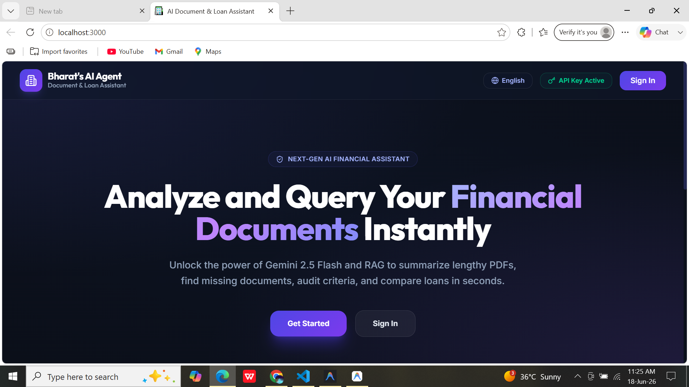
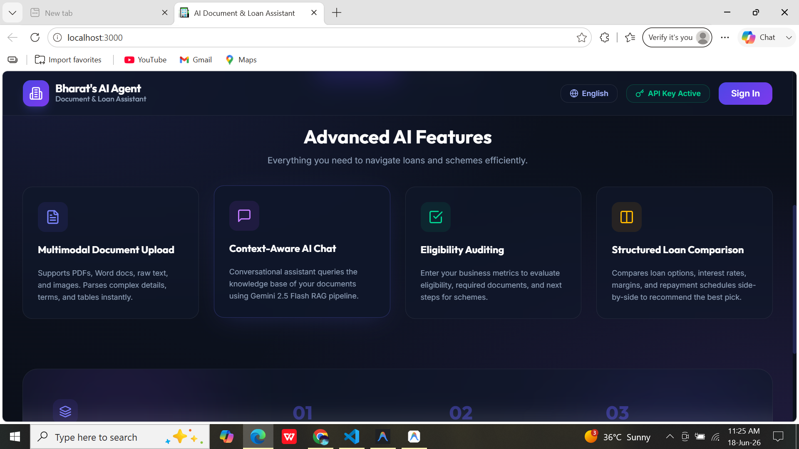
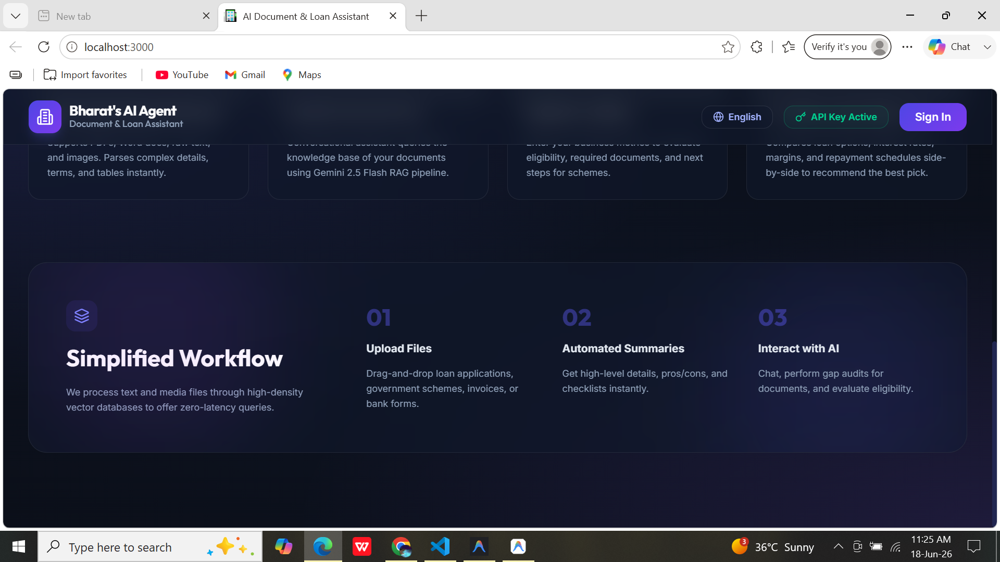
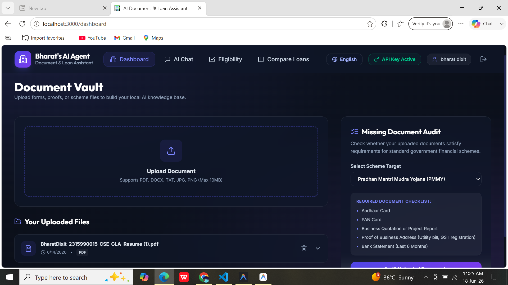
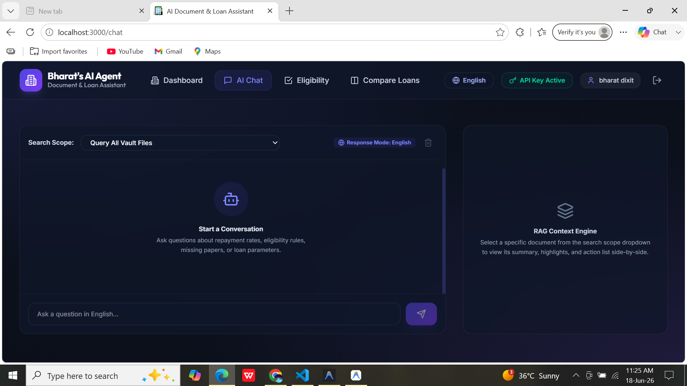
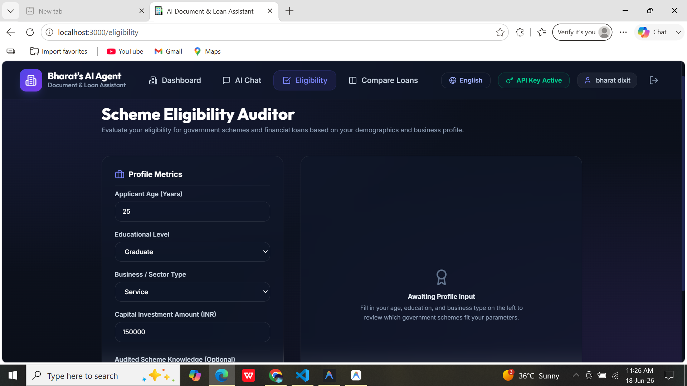
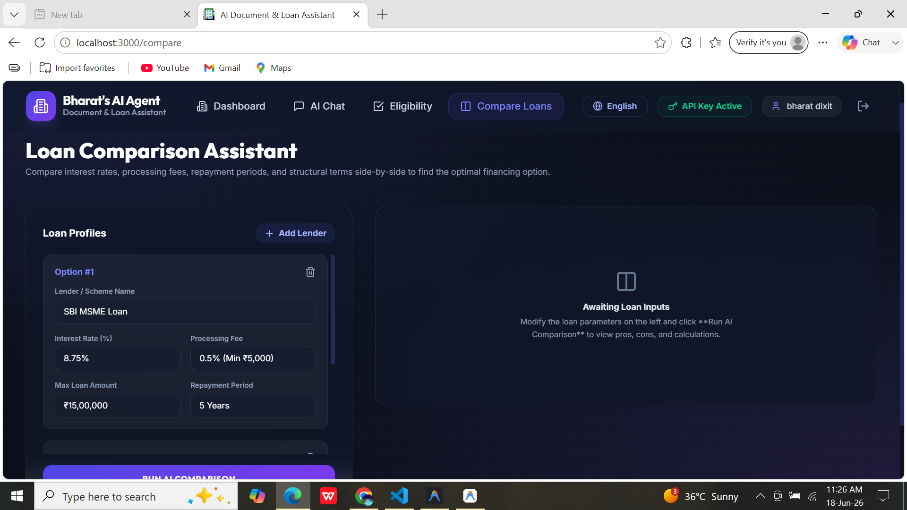
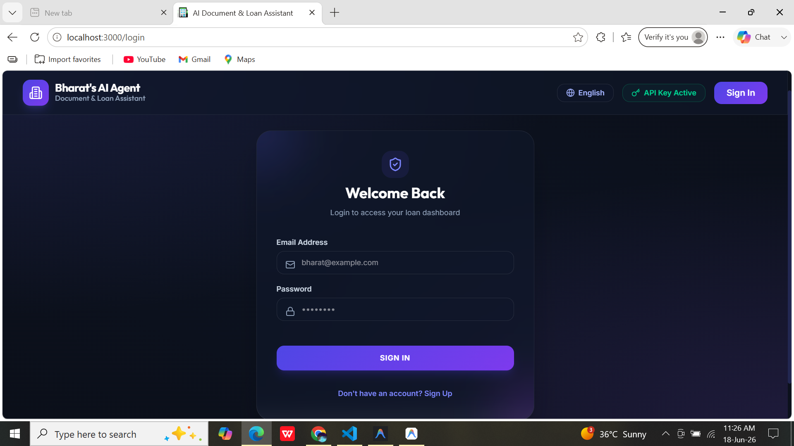

# AI Loan Document Assistant 🏦🤖

An intelligent, AI-powered platform designed to streamline the loan application process. This application assists users by checking loan eligibility, analyzing missing documents, and providing a conversational interface for all loan-related queries using advanced RAG (Retrieval-Augmented Generation) and Gemini AI.

### 🔗 [Live Demo](https://ai-loan-document-assistent-1.onrender.com)










## 🌟 Features

- **Document Upload & Parsing**: Securely upload PDF documents for instant AI analysis.
- **RAG-based AI Chat**: Conversational assistant capable of answering contextual queries about loans, schemes, and documentation.
- **Eligibility Checker**: Automated validation of user profiles against available loan schemes.
- **Missing Document Detection**: Proactively identifies required documents that haven't been submitted yet.
- **Loan Comparison**: Easy-to-understand side-by-side comparison of different loan options.
- **Bilingual Support**: Chat natively in multiple languages for better accessibility.

## 💻 Tech Stack

### Frontend
- **React.js** (Vite)
- **TailwindCSS** for responsive and modern UI
- **React Router** for seamless navigation
- **Lucide Icons**

### Backend
- **Node.js** & **Express.js**
- **MongoDB** & **Mongoose** for database management
- **Google Gemini AI** for natural language understanding and responses
- **Multer** for handling file uploads
- **JSON Web Tokens (JWT)** for secure authentication

## 🚀 Getting Started

### Prerequisites
- Node.js (v18+ recommended)
- MongoDB instance (local or Atlas)
- Google Gemini API Key

### Installation

1. **Clone the repository:**
   ```bash
   git clone https://github.com/ErBharatdixit/Ai-Loan_Document_Assistent.git
   cd Ai-Loan_Document_Assistent
   ```

2. **Backend Setup:**
   ```bash
   cd backend
   npm install
   ```
   Create a `.env` file in the `backend` directory based on `.env.example`:
   ```env
   PORT=5000
   MONGODB_URI=your_mongodb_connection_string
   GEMINI_API_KEY=your_gemini_api_key
   JWT_SECRET=your_jwt_secret
   ```
   Start the backend server:
   ```bash
   npm run dev
   ```

3. **Frontend Setup:**
   ```bash
   cd frontend
   npm install
   ```
   Start the development server:
   ```bash
   npm run dev
   ```

4. Open your browser and navigate to `http://localhost:5173`.

## 🤝 Contributing

Contributions, issues, and feature requests are welcome! Feel free to check the issues page.

## 📝 License

This project is open-source and available under the [MIT License](LICENSE).
